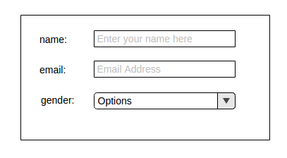
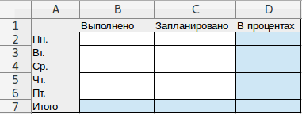
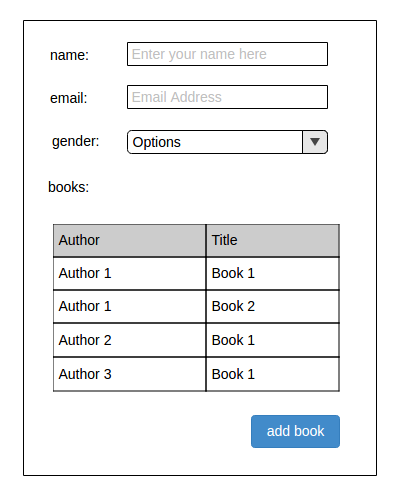

# Report

## About

Конструктор форм по правилам, описанным в yml файле.

## Description

Конструктор форм:
* конвертация yml схемы в объектно-ориентированную модель

База данных:
* конвертация объекто-ориентированного представления формы в реляционное
* поиск

### Компоненты

Компоненты ввода значений
* **input**
* **checkbox**
* **select**

Компоненты вычисляемые значения
* **summary** - вычисляет сумму значений указанных элементов
* **percentage** - вычисляет процентное отношение

Компоненты хранятся в коллекциях - компонентах типа **accumulation**, которые служат для группировки элементов в форме и могут содержать вложенные коллекции (другие accumulation и template).

**template** - коллекция, содержащая схему для генерации коллекций компонентов.

### Пример: базовые элементы

Форма-опросник пользователей, в которой они указывают свои имя, адрес електронной почты и пол.

Схематическое представление:



Описание в формате yml:

```yml
name: form01
pile:

    - name: name
      type: input

    - name: email
      type: input

    - name: gender
      type: select
      options: ["male", "female"]
```

Сгенерированные объекты:

```
App\Unit\Accumulation Object
(
    [children:protected] => Array
        (
            [0] => App\Unit\Input Object
                (
                    [value:App\Unit\Input:private] =>
                    [name:protected] => name
                )

            [1] => App\Unit\Input Object
                (
                    [value:App\Unit\Input:private] =>
                    [name:protected] => email
                )

            [2] => App\Unit\Select Object
                (
                    [value:App\Unit\Select:private] =>
                    [options:App\Unit\Select:private] => Array
                        (
                            [0] => male
                            [1] => female
                        )

                    [name:protected] => gender
                )

        )

    [name:protected] => form01
)
```

### Пример: вычисляемые значения

Схематическое представление:



* Ячейки B2, B3, B4, B4, B6, C2, C3, C4, C5, C6 предназначены для ввода значений
* Ячейки B7 и C7 являются суммой столбцов и равны `SUM(B2,B3,B4,B5,B6)` и `SUM(C2,C3,C4,C5,C6)`
* Ячейки столбца D вычисляют процентное значение соответсвующих строк

Описание в формате yml:

```yml
name: form03
pile:
    - { name: B2, type: input }
    - { name: B3, type: input }
    - { name: B4, type: input }
    - { name: B5, type: input }
    - { name: B6, type: input }
    - { name: B7, type: summary, paths: [B2, B3, B4, B5, B6] }
    - { name: C2, type: input }
    - { name: C3, type: input }
    - { name: C4, type: input }
    - { name: C5, type: input }
    - { name: C6, type: input }
    - { name: C7, type: summary, paths: [C2, C3, C4, C5, C6] }
    - { name: D2, type: percentage, paths: [B2, C2] }
    - { name: D3, type: percentage, paths: [B3, C3] }
    - { name: D4, type: percentage, paths: [B4, C4] }
    - { name: D5, type: percentage, paths: [B5, C5] }
    - { name: D6, type: percentage, paths: [B6, C6] }
```

### Пример: шаблоны

Форме из первого примера добавлена возможность указать список любимых книг.



Описание в формате yml:

```yml
name: form02
pile:

    - name: name
      type: input

    - name: email
      type: input

    - name: gender
      type: select
      options: ["male", "female"]

    - name: books
      type: template
      schema:
          - name: author
            type: input

          - name: title
            type: input
```

Сгенерированные объекты:

```
App\Unit\Accumulation Object
(
    [children:protected] => Array
        (
            [0] => App\Unit\Input Object
                (
                    [value:App\Unit\Input:private] =>
                    [name:protected] => name
                )

            [1] => App\Unit\Input Object
                (
                    [value:App\Unit\Input:private] =>
                    [name:protected] => email
                )

            [2] => App\Unit\Select Object
                (
                    [value:App\Unit\Select:private] =>
                    [options:App\Unit\Select:private] => Array
                        (
                            [0] => male
                            [1] => female
                        )

                    [name:protected] => gender
                )

            [3] => App\Unit\Template Object
                (
                    [schema:protected] => Array
                        (
                            [0] => Array
                                (
                                    [name] => author
                                    [type] => input
                                )

                            [1] => Array
                                (
                                    [name] => title
                                    [type] => input
                                )

                        )

                    [children:protected] => Array
                        (
                        )

                    [name:protected] => books
                )

        )

    [name:protected] => form02
)
```


## Requirements

- Docker

## Install & Up

- `make install`
- `make up`
- используя phpMyAdmin импортировать _schema.sql_

## Usage

ReportApp `http://127.0.0.1:8080`

phpMyAdmin `http://127.0.0.1:8081`

Использование Makefile:
- `make install` - выполняет **composer install**
- `make autoload` - выполняет **composer dump-autoload**
- `make lint` - проверяет код на соответсвие стандарту _PSR-2_
- `make tests` - запускает тесты _phpunit_, с конфигурацией из _phpunit.xml.dist_
- `make up` - создаёт и запускает docker контейнеры
- `make down` - удаляет docker контейнеры

## TODO
- [ ] DataMapper: delete feature
- [ ] `Unit\Accumulation` фиксировать факт изменения значений ячейки или части дерева (Visitor pattern) для сохранения в маппере
- [ ] Заменить типы summary, percentage на тип, принимающий "формулы" (Interpeter pattern)
